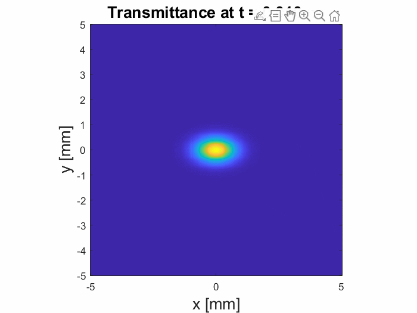
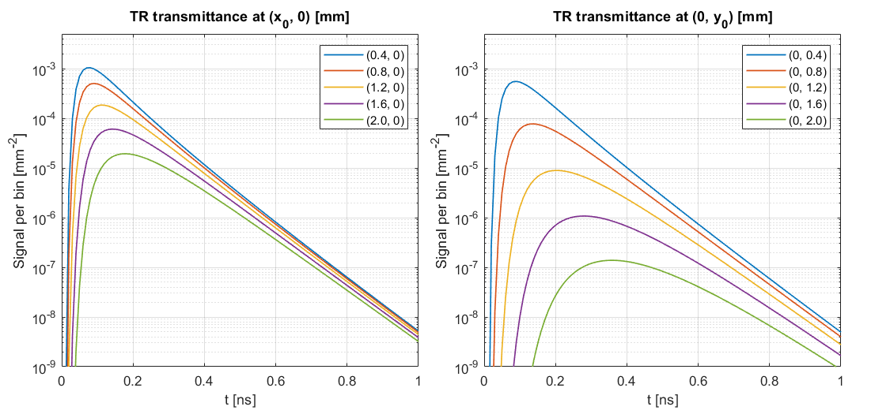

# Generalized ADE

MATLAB and Python implementations of the generalized anisotropic diffusion equation (ADE) for radiative transfer in slab geometry, as derived in:

**E. Pini et al.**  
*Generalized diffusion theory for radiative transfer in fully anisotropic scattering media.*  
arXiv preprint arXiv:2602.18963 (2026).

The repository provides routines for fully anisotropic scattering media with principal-axis scattering coefficients `musx`, `musy`, `musz`, scalar Henyey-Greenstein asymmetry factor `g`, refractive-index mismatch at the slab boundaries, and homogeneous absorption `mua`.

## Units convention

All MATLAB and Python functions use the same units:

- lengths in `mm`
- optical coefficients in `mm^-1`
- time in `ns`

Accordingly:

- `Dx`, `Dy`, `Dz` are in `mm^2/ns`
- `ze`, `z0` are in `mm`
- total reflectance and transmittance are dimensionless
- time-resolved signals are in `ns^-1`
- space-resolved signals are in `mm^-2`
- time- and space-resolved signals are in `mm^-2 ns^-1`

For resolved outputs, the numerical values match between MATLAB and Python, but
the array layout is not identical: Python returns `(ny, nx)` or `(ny, nx, nt)`
arrays, while the MATLAB functions natively return
`numel(x)`-by-`numel(y)` or `numel(x)`-by-`numel(y)`-by-`numel(t)` arrays and
the MATLAB examples transpose or permute them for plotting.

## Repository structure

```text
Generalized ADE/
├── README.md
├── LICENSE
├── CITATION.cff
├── matlab/
│   ├── D_Tensor_ADE.m
│   ├── BC_ADE.m
│   ├── R_ADE.m
│   ├── Rt_ADE.m
│   ├── Rxy_ADE.m
│   ├── Rxyt_ADE.m
│   ├── T_ADE.m
│   ├── Tt_ADE.m
│   ├── Txy_ADE.m
│   ├── Txyt_ADE.m
│   ├── gauss_legendre.m
│   └── examples/
│       └── demo_general_anisotropic.m
├── python/
│   ├── README.md
│   ├── pyproject.toml
│   ├── pytest.ini
│   ├── examples/
│   │   └── demo_general_anisotropic.py
│   ├── src/
│   │   └── generalized_ade/
│   └── tests/
│       ├── reference/
│       ├── test_smoke.py
│       ├── test_diffusion_reference.py
│       ├── test_boundary_reference.py
│       └── test_resolved_reference.py
└── validation/
    └── matlab_export/
        └── export_d_tensor_reference.m
```

Additional validation exporters live in `validation/matlab_export/`:
`export_bc_reference.m`, `export_d_tensor_reference.m`, and
`export_resolved_reference.m`.

## MATLAB functions

### Core coefficients
- `D_Tensor_ADE.m` — diffusion tensor components `Dx`, `Dy`, `Dz`
- `BC_ADE.m` — extrapolated boundary length `ze` and source depth `z0`

### Reflectance
- `R_ADE.m` — total steady-state reflectance
- `Rt_ADE.m` — total time-resolved reflectance
- `Rxy_ADE.m` — space-resolved steady-state reflectance
- `Rxyt_ADE.m` — time- and space-resolved reflectance

### Transmittance
- `T_ADE.m` — total steady-state transmittance
- `Tt_ADE.m` — total time-resolved transmittance
- `Txy_ADE.m` — space-resolved steady-state transmittance
- `Txyt_ADE.m` — time- and space-resolved transmittance

### Numerical helper
- `gauss_legendre.m` — Gauss-Legendre quadrature nodes and weights on `[-1,1]`

## Python package

The Python package matches the MATLAB implementation numerically and exposes:

- `gauss_legendre`
- `d_tensor_ade`
- `bc_ade`
- `r_ade`, `rt_ade`, `rxy_ade`, `rxyt_ade`
- `t_ade`, `tt_ade`, `txy_ade`, `txyt_ade`

### Installation

From the `python/` folder:

```bash
python -m pip install -e . --no-build-isolation
```

In a typical networked environment, `python -m pip install -e .` also works.

## MATLAB example: Time- and space-resolved transmittance in an anisotropic slab

```matlab
%% Medium parameters
L     = 1.0;    % slab thickness [mm]
n_in  = 1.3;    % internal refractive index [-]
n_ext = 1.0;    % external refractive index [-]
mua   = 0.01;   % absorption coefficient [mm^-1]
musx = 30;      % scatt. coeff along x [mm^-1]
musy = 100;     % scatt. coeff along y [mm^-1]
musz = 50;      % scatt. coeff along z [mm^-1]
g = 0.85;       % Henyey-Greenstein asymmetry factor

%% Temporal and spatial grids
dt = 0.01;      % time step [ns]  = 10 ps
dx = 0.05;      % space step [mm] = 50 um
t = 0.01:dt:1;  % time array [ns]
x = -5:dx:5;    % x grid [mm]
y = x;          % y grid [mm]

%% Initial beam widths at t = 0
sx = 0.01;      % [mm] = 10 um
sy = 0.01;      % [mm] = 10 um

Txyt = Txyt_ADE(x, y, t, L, n_in, n_ext, musx, musy, musz, g, sx, sy, mua)  * dt * dx^2;

figure()
for i = 1:numel(t)
    imagesc(x, y, Txyt(:,:,i).');
    axis image tight;
    axis xy;
    xlabel('x [mm]', 'FontSize', 16);
    ylabel('y [mm]', 'FontSize', 16);
    title(sprintf('Transmittance at t = %.3f ns', t(i)), 'FontSize', 16);
    drawnow;
end
```


## Example: Time-resolved transmittance at different locations in an anisotropic slab

```matlab
%% Medium parameters
L     = 1.0;    % slab thickness [mm]
n_in  = 1.3;    % internal refractive index [-]
n_ext = 1.0;    % external refractive index [-]
mua   = 0.01;   % absorption coefficient [mm^-1]
musx = 200;      % scatt. coeff along x [mm^-1]
musy = 1000;     % scatt. coeff along y [mm^-1]
musz = 500;      % scatt. coeff along z [mm^-1]
g = 0.85;       % Henyey-Greenstein asymmetry factor

%% Temporal and spatial grids
dt = 0.01;      % time step [ns]  = 10 ps
dx = 0.4;       % space step [mm] = 400 um
t = 0.01:dt:1;  % time array [ns]
x = 0.4:dx:2.0; % x collection positions [mm]
y = x;          % y collection positions [mm]

%% Initial beam widths at t = 0
sx = 0.01;      % [mm] = 10 um
sy = 0.01;      % [mm] = 10 um

Txyt_x = squeeze(Txyt_ADE(x, 0, t, L, n_in, n_ext, musx, musy, musz, g, sx, sy, mua)).' * dt;
Txyt_y = squeeze(Txyt_ADE(0, y, t, L, n_in, n_ext, musx, musy, musz, g, sx, sy, mua)).' * dt;

figure()
tl = tiledlayout(1, 2, 'Padding', 'compact', 'TileSpacing', 'compact');

nexttile, hold on, grid on, box on
title('TR transmittance in (x_0, 0) [mm]')
plot(t, Txyt_x, 'LineWidth', 1)
set(gca, 'YScale', 'log')
xlabel('t [ns]'), ylabel('Signal [mm^{-2}]')
axis([0 max(t) 1e-15 5e-10])
legend(arrayfun(@(xi) sprintf('(%.0f, 0)', xi), x, 'UniformOutput', false), 'Location', 'northeast')

nexttile, hold on, grid on, box on
title('TR transmittance in (0, y_0) [mm]')
plot(t, Txyt_y, 'LineWidth', 1)
set(gca, 'YScale', 'log')
xlabel('t [ns]'), ylabel('Signal [mm^{-2}]')
axis([0 max(t) 1e-15 5e-10])
legend(arrayfun(@(yi) sprintf('(0, %.0f)', yi), y, 'UniformOutput', false), 'Location', 'northeast')
```


## Examples

- MATLAB: `matlab/examples/demo_general_anisotropic.m`
- Python: `python/examples/demo_general_anisotropic.py`

Both examples illustrate a fully anisotropic case with `musx ~= musy ~= musz` and `g > 0`, including:

- diffusion tensor and boundary conditions
- total reflectance and transmittance
- time-resolved reflectance and transmittance
- space-resolved maps
- time- and space-resolved signals

## Validation

The Python implementation has been benchmarked against the MATLAB implementation on isotropic and anisotropic test cases, including:

- `d_tensor_ade` vs `D_Tensor_ADE`
- `bc_ade` vs `BC_ADE`
- all reflectance/transmittance functions in steady-state, time-resolved, space-resolved, and time-space-resolved forms

Tests are organized under `python/tests/` and are ready for `pytest`.

## Citation

If you use this repository, please cite the associated preprint and the software metadata provided in `CITATION.cff`.

## Author

**Ernesto Pini**  
Istituto Nazionale di Ricerca Metrologica (INRiM)  
pinie@lens.unifi.it
